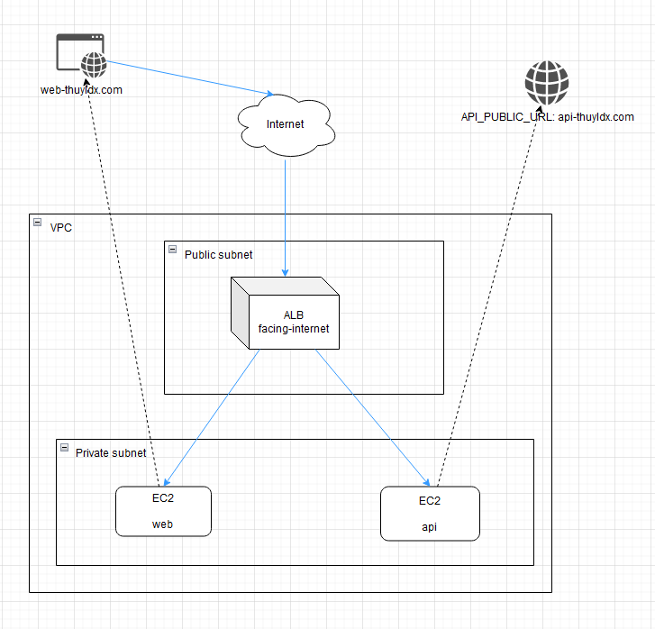

# simple-microservices

**Mô hình ALB AWS**


```sh
git clone https://github.com/mercy-thuyle/simple-microservices.git --recursive --jobs 2
```

hoặc

```sh
git clone https://github.com/mercy-thuyle/simple-microservices.git

git submodule update --init --recursive
```


## Front-end
### web
[README FE](https://github.com/mercy-thuyle/web-simple-microservices)

## Back-end
### api
[README BE](https://github.com/mercy-thuyle/api-simple-microservices)
